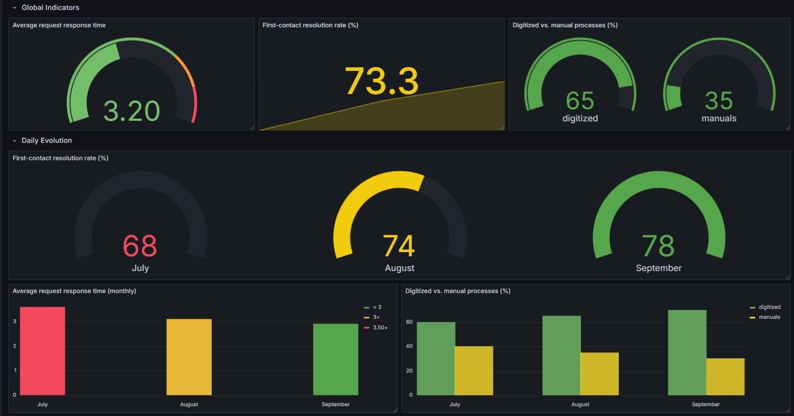
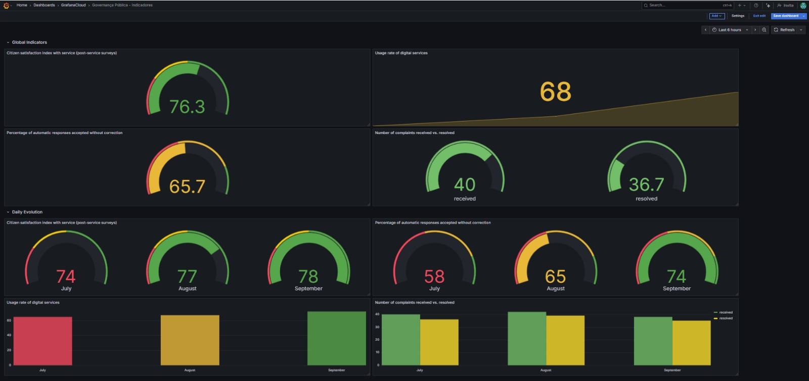
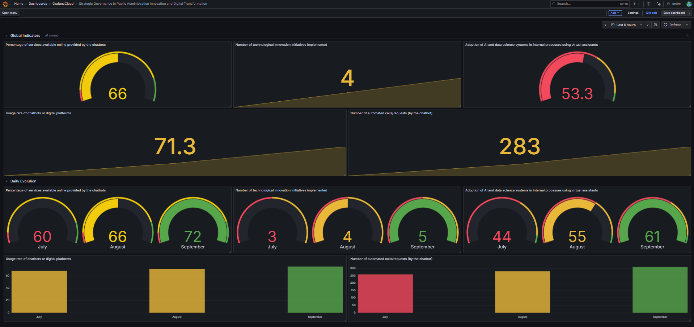
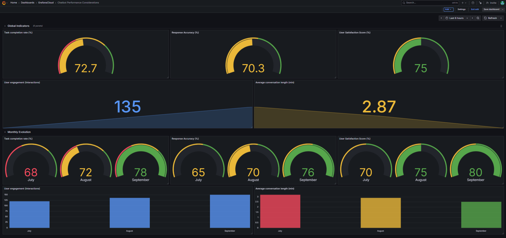

# Strategic Governance Dashboards (Grafana)

Grafana dashboards to evaluate **strategic governance in public administration**, organized by domains and indicators defined in the *Strategic Governance in Public Administration Evaluation Guidelines*.

**Objective**: provide a clear view of global indicators and their monthly evolution (Jul–Sep) in three domains:

- **Operational Indicators**
- **Citizen Satisfaction & Experience**
- **Innovation & Digital Transformation**

---

## 📁 Repository Structure

```plaintext
strategic-governance-dashboards/
├─ dashboards/
│ ├─ operational.json
│ ├─ citizen_experience.json
│ └─ innovation_digital.json
├─ docs/
│ └─ screenshots/
│ ├─ operational.png
│ ├─ citizen_experience.png
│ └─ innovation_digital.png
└─ README.md
```


- `dashboards/*.json`: exported dashboards (Classic model) ready to import into Grafana.  
- `docs/screenshots/*`: illustrative images for the README and report.

---

## 🧭 Dashboard Overview

Each dashboard includes:

- **Global indicators row (top)** – aggregated values (e.g., average or total).  
- **Daily Evolution section (bottom)** – monthly evolution **July–August–September** in bar charts or per-month gauges.  

### Standardized colors / thresholds
- **Green**: good performance  
- **Yellow**: attention needed  
- **Red**: critical  


## 1) Operational Indicators

**Focus**: efficiency and effectiveness of administrative services.

### Indicators (global + monthly)
- **Average response time to citizen requests**  
  - Global: average   
  - Monthly: bar chart (Jul, Aug, Sep)

- **First-contact resolution rate (%)**  
  - Global: average in %  
  - Monthly: gauges per month

- **Digitized vs. manual processes (%)**  
  - Global: two gauges (digitized and manual)  
  - Monthly: grouped bar chart (two series)

**Screenshot (example):**  


---

## 2) Citizen Satisfaction & Experience

**Focus**: citizen satisfaction and service experience.

### Indicators (global + monthly)
- **Citizen satisfaction index (post-service surveys)**  
  - Global: average in %  
  - Monthly: gauges per month

- **Usage rate of digital services**  
  - Global: average in %  
  - Monthly: bar chart

- **% of automatic responses accepted without correction**  
  - Global: average in %  
  - Monthly: gauges per month

- **Complaints received vs. resolved**  
  - Global: two gauges (received and resolved)  
  - Monthly: bar chart with two series

**Screenshot (example):**  


---

## 3) Innovation & Digital Transformation

**Focus**: adoption of digital solutions and automation.

### Indicators (global + monthly)
- **% of services available online provided by chatbots**  
  - Global: gauge  
  - Monthly: gauges per month

- **Usage rate of chatbots or digital platforms**  
  - Global: average in %  
  - Monthly: bar chart

- **# of technological innovation initiatives implemented**  
  - Global: total  
  - Monthly: gauges / bars (depending on panel)

- **# of automated calls/requests (by the chatbot)**  
  - Global: total  
  - Monthly: bar chart

- **Adoption of AI & data science in internal processes (virtual assistants)**  
  - Global: gauge (%)  
  - Monthly: gauges per month

**Screenshot (example):**  



4) Chatbot Performance Considerations

Focus: assess the chatbot’s ability to provide real-time, accurate, and satisfactory interactions with citizens.  
This dashboard evaluates efficiency, effectiveness, and user experience through a combination of performance and engagement metrics.

**Indicators (global + monthly):**

- **Task completion rate (%)**  
  - Global: gauge  
  - Monthly: gauges per month  

- **User engagement (number of interactions)**  
  - Global: stat (total interactions)  
  - Monthly: bar chart (Jul–Sep)  

- **Average conversation length (minutes)**  
  - Global: stat (mean value)  
  - Monthly: bar chart  

- **User satisfaction score (%)**  
  - Global: gauge  
  - Monthly: gauges per month  

- **Response accuracy (%)**  
  - Global: gauge  
  - Monthly: gauges per month  

**Screenshot (example):**



---

## 🛠️ How to Import the Dashboards into Grafana

1. Go to Grafana → *Dashboards* → **Import**  
2. Upload a `.json` file from the `dashboards/` folder in this repository  
3. **Select Data Source**:  
   - The JSONs were created using **grafana-testdata-datasource** with the *Scenario* **CSV Content** (ideal for demo).  
   - For real data, connect to your own source (e.g., Prometheus, Postgres, CSV plugin, etc.).  
4. Click **Import** → the panel will appear in Grafana.  

> **Tip**: to modify example data, open the panel → **Edit** → *Queries* section → *Scenario*: **CSV Content** and edit the embedded CSV (e.g., `month,value`).

---

## 🧪 Example Data (Jul–Sep)

The dashboards include **fictitious demo data** to illustrate:

- **Percentage metrics** (e.g., satisfaction, digital usage, FCR)  
- **Count metrics** (e.g., initiatives, automated calls, complaints)  
- **Average response time (days)**  

> These demo values can be replaced with real integrations (DB, APIs, etc.).